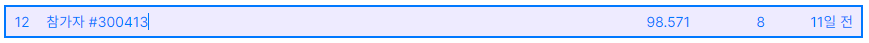
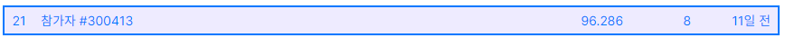

# 2021 Dev Matching 머신러닝 개발자

## Image Classification

- 이미지 분류 문제가 주어집니다.
- 과제 제출 시 리더보드에 내 점수가 기록되며, 다른 지원자들의 점수도 확인할 수 있습니다.
- 과제 테스트를 진행 할 수 있는 시간은 8시간입니다.

## Model

model : `tf_efficientnet_b3_ns`

## Result

###### Pubilc Score

###### Private Score

## Reference

https://programmers.co.kr/competitions/1109/2021-machinelearning
